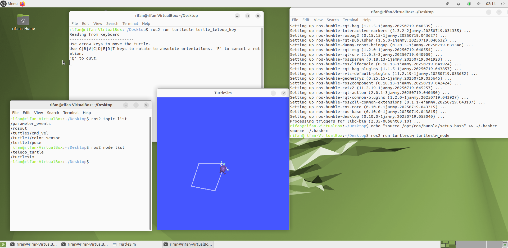
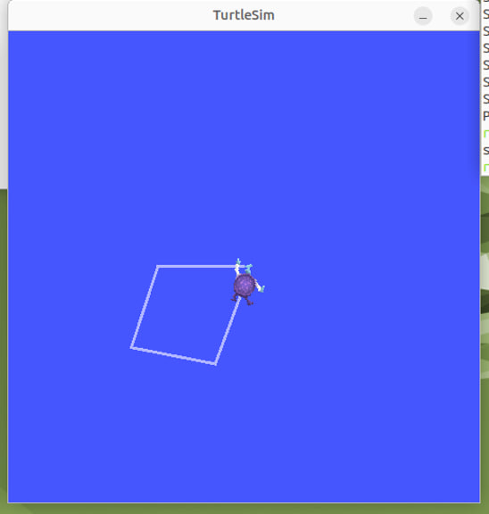
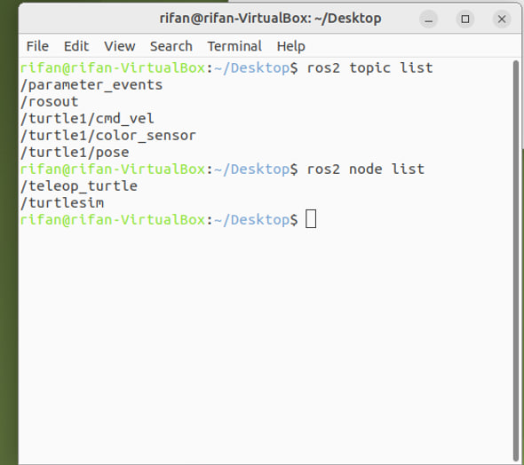

# ROS2 Turtlesim 

## 🧠 About the Project

This project focuses on using the Turtlesim package in ROS2 to simulate robot movement and understand how the ROS2 communication system works. The main objective is to launch the simulation, control the turtle in real time using the keyboard, and observe the flow of data through topics and nodes.

The project includes:
- Running a graphical simulation of a turtle robot.
- Moving the turtle using arrow keys to draw simple shapes.
- Displaying the list of active ROS2 topics and nodes.
- Practicing how to run and monitor ROS2 components using terminal commands.

---

## 🧾 Files in This Repo

| File Name                   | Description                                                |
|----------------------------|------------------------------------------------------------|
| ros2_showcase.png         | Terminal showing ros2 run, ros2 topic list, and results |
| turtlesim_window.png      | Main TurtleSim GUI showing turtle movement                 |
| ros2_topics_and_nodes.png | Output of ros2 topic list and ros2 node list           |

All images are placed inside the images/ folder.

---

## 🐢 Turtle Simulation Window

Below is the main turtlesim GUI window that shows the turtle in motion. The turtle was moved using arrow keys to trace a square path.

---

## 📜 ROS2 Topics and Nodes

The following image shows the result of running terminal commands to list all active topics and nodes. These help us understand how data flows in ROS2.

---

## ✅ How to Run This Task

Follow these steps to reproduce the project setup:

### 1. Set up Virtual Machine
- Install VirtualBox and Ubuntu MATE (recommended for lightweight performance).
- Enable copy-paste and shared folder access (install Guest Additions if needed).

### 2. Update the Systemsudo apt update
sudo apt upgrade

### 3. Install ROS2 

### 4. Run TurtleSim Node
Open a terminal and run:ros2 run turtlesim turtlesim_node
This launches the turtle simulation GUI.

### 5. Control the Turtle with Keyboard
Open another terminal and run:ros2 run turtlesim turtle_teleop_key
Use arrow keys to move the turtle. Try to trace basic shapes like a square or triangle.

### 6. View Active Topics
In any terminal:ros2 topic list

### 7. View Active Nodesros2 node list
